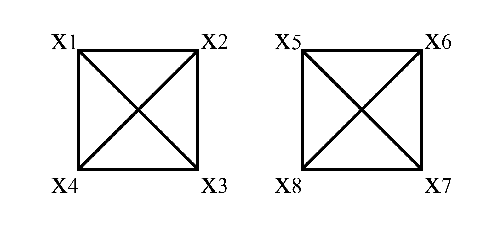

This paper presents our various methodologies to translate a non-linear
code into a Hamiltonian that can be solved by Adiabatic Quantum
Computation using available quantum annealing platforms. It covers the
transformation of the problem to solve into Hamiltonian and the
decomposition of multi-qubit terms up to at most two-qubit interactions
required for the real machine implementation. The characteristics of the
D-Wave machines used to run the adiabatic evolutions are also detailed.

Introduction
============

Coding theory is concerned with the design of error-correcting codes
(linear codes and nonlinear codes) and their parameters. While linear
codes allow for a higher efficiency in encoding and decoding algorithms
vs. their non-linear counterpart, there is a high interest in designing
and studying nonlinear codes given that select nonlinear codes exhibit
some of the best properties, with a large potential of applications to
communication channel models, such as binary erasure channel, and vector
quantization @conway1986soft.

In this paper, we explore adiabatic evolution - enabled using
commercially available computers - as an alternative tool to quantum
gate-based architectures, to execute a brute force search on random
codes, both linear and nonlinear codes.

For linear codes, our implementation reveals that using adiabatic
evolution performs poorly as compared to the best existing algorithmic
paradigm known as the Information Set Decoding (ISD), due to limitations
of the Hamiltonian with today’s superconducting computers (D-wave) to
two body interactions, thus performing poorly in the case of higher
order polynomial optimizations (**Najwa: I will put results
later**). There is a merit, however, in future work, to
investigate specific type of codes, where quantum brute force might be
less complex than ISD.

In the case of non-linear codes, (**Najwa: Arrived here, I will
continue**)

Our results are a first step towards demonstrating the efficiency of
adiabatic evolution in quantum annealers in solving codes. We foresee
that an evolution of Quantum Annealing architectures (example, support
to n-body interactions) would reveal a quantum advantage for coding
theory, including solving linear codes. For example, (**Najwa: we
describe here a small example showing what would happen if we could have
n-body interactions and how the number of ancillas would
decrease**)

This paper is organized as follows. (**Najwa: Arrived here, I will
continue**)

Related work {#sec:related_work}
============

Decoders for special codes of size $|C|$ and length $n$ (such as the
simplex code @macwilliams1977theory, the universe code, the even-weight
code, codes with small redundancy, supercodes, direct sums codes,
shortened codes, etc.) that are faster than a direct search (of
complexity $n|C|$) have been extensively studied in the past. A good
overview of such decoding algorithms can be found in the work of Conway
et al. @conway1986soft, where a decoder for the Golay code is presented.
Zinoviev et al. @zinov1978decoding, in 1978, proposed a multistage
decoding algorithm for generalized concatenated codes. Based on the work
of Conway et al., Dehgani et al. @dehgani1990apparatus patented a
maximum likelihood (ML) decoder for the (16,256,6) Nordstrom-Robinson
nonlinear code for 15 transmissions in an Additive White Gaussian Noise
channel.

All the above decoders are of course designed to only work for their
specific family of codes. For linear codes, a general decoding algorithm
is the syndrome decoding, which is only suitable for linear codes with a
small codimension. Other general decoding methods are based on finding a
vector of minimum weight in a linear code or a coset of a linear code.
The only work we are aware of, dealing with a generic decoder for codes
(including nonlinear ones), is that of Villanueva et al.
@villanueva2015efficient, where the kernel/coset representation of the
code is exploited to essentially divide the code in smaller linear codes
and decode each linear code with syndrome decoding techniques, and
combining the results at the end. The larger is the kernel of the code,
the closer the complexity of the above method becomes to the one of
brute force. Other useful representations of codes exists, as the
representation of a code as a set of Boolean functions
@guerrini2010computing [@bellini2018deterministic]. As far as we know,
no decoder is known exploiting this representation, not even in the case
that such representation is sparse.

Using quantum computers, it is usually possible to accelerate classical
decoding algorithms, both in the case of specific code families or in
the more general case of arbitrary (both linear and nonlinear) codes.
Barg and Zhou, in 1998, proposed, for the first time, a quantum
implementation of the decoding of the (classical) simplex code of length
$n$, proposing an algorithm that operates on a circuit of size
$O(\log^2(n))$ and time complexity $O(\log^2(n))$. In the same work, the
authors state, for the first time, that as an immediate consequence of
Grover’s quantum search algorithm @search-grover1996, the decoding of
any (not necessarily linear) code of length $n$ can be solved on a
quantum computer of circuit size $O(n|C|^{1/2})$ in time
$O(n|C|^{1/2})$, which is essentially optimal following a result in
@bennett1997strengths. The main concern about this claim has been raised
by Bernstein @bernstein2010grover, who points that representing an
arbitrary nonlinear code of length $n$ and rate $R$ requires almost
$n2^{Rn}$ bits of information (or $O(n2^{Rn/2})$ qubits). Later,
Overbeck and Sendrier @overbeck2009code tried to analyze the
implications of applying Grover algorithm to syndrome decoding
techniques targeting linear codes, concluding that the combinatorial
search in advanced forms of information-set decoding (e.g., the
collision search introduced by Stern in @stern1988method) “achieves the
same speed-up as Grover’s algorithm would achieve.”, and that using
Grover’s algorithm for “the guessing phase” is essentially not possible.
This last point is proved wrong by Bernstein @bernstein2010grover. In
his work, Bernstein shows that quantum versions of the most basic form
of Information Set Decoding (ISD) algorithms (due to Prange
@prange1962use) takes - in terms of time - only $c^{(1/2+o(1))n/\ln n}$
to break a length-$n$ rate-$R$ linear code (with $0 < R < 1$), while
classically, it takes $c^{(1+o(1))n/\ln n}$ (for a certain constant
$c$). Improved versions of Prange algorithm yield improved versions of
their quantum versions, as shown by Kachigar and Tillich in 2017
@kachigar2017quantum, which also take advantage of quantum walks. This
last work was further improved by Kirshanova @kirshanova2018improved by
proposing an alternative view on the quantum walks.

All the above quantum techniques only consider the use of universal
fault-tolerant quantum computers, and usage has been mostly restricted
to improving linear code decoders. While a universal fault-tolerant
quantum computer is very difficult to build in practice, a somehow
weaker form of quantum computer, called *adiabatic* quantum computer,
has already reached several thousands qubits and is commercially
available. Adiabatic computation was recently exploited by Joseph et al.
to tackle the Shortest Vector Problem @joseph2020not, which is the
lattice analogue of the decoding problem. In this work, we explore how
adiabatic evolution can be used to speed up decoders for both linear and
nonlinear codes. In the case of linear codes and generic nonlinear
codes, we show that the main obstacle resides in the representation of
the problem, which requires an exponential size memory. On the other
hand, we define a special class of codes for which adiabatic evolution
can indeed speedup the brute-force decoding algorithm, with a complexity
that is similar to what one can achieve with a universal fault-tolerant
quantum computer.

Preliminaries {#sec:preliminaries}
=============

We denote by $\mathbb{F}_2$ the binary field with two elements. The set
$\mathbb{F}_2^r$ is the set of all binary vectors of length $r$, viewed
as an $\mathbb{F}_2$-vector space. Let $n\geq k\geq 1$ be integers. Let
$C \subseteq \mathbb{F}_2^n$, $C \ne \emptyset$. We say that $C$ is a
binary $(n,|C|)$-*code* (since we only deal with binary codes, we often
omit the word “binary”). Any $ c\in C$ is a *codeword*. If $C$ is a
vector subspace of dimension $k$ of $\mathbb{F}_2^n$, then $C$ is a
binary $[n,k]$-*linear code*. Let $v\in\mathbb{F}_2^n$. The *Hamming
weight* $\mathsf{w}(v)$ of the vector $v$ is the number of its nonzero
coordinates. For any two vectors $v_1,v_2\in\mathbb{F}_2^n$, the
*Hamming distance* between $v_1$ and $v_2$, denoted by
$\mathsf{dist}(v_1,v_2)$, is the number of coordinates in which the two
vectors differ. We call *minimum weight* of a code $C$ the integer
$w = \min \{\mathsf{w}(c) \mid c \in C\}$, and *(minimum) distance* of a
code $C$ the integer
$d = \min \{\mathsf{d}(c,c') \mid c,c' \in C,c \ne c'\}$. If $C$ is an
$(n,|C|)$-code with distance $d$ then we can write that $C$ is an
$(n,|C|,d)$-code.\

Recall that we only consider binary codes, i.e. codes over the finite
field $\mathbb{F}_2$ of length $n$, with $M$ codewords. Any binary
$(n,2^k)$-code $C$ can be represented in a unique way as a set of $n$
Boolean functions $f_1, \ldots, f_n : \mathbb{F}_2^k \to \mathbb{F}_2$
(see @carlet10boolean for a comprehensive introduction to Boolean
functions, and @macwilliams1977theory for codes). We indicate with
${f^{(\mathbb{F})}}$ a Boolean function represented in algebraic normal
form, and with ${f^{(\mathbb{Z})}}$ a Boolean function represented in
numerical normal form.

Given a binary $(n,2^k)$-code $C$, consider a fixed order of the
codewords of $C$ and of the vectors of $\mathbb{F}_2^k$. Then consider
the matrix $M$ whose rows are the codewords of $C$. We call the
*defining polynomials* of the code $C$ the set $\{f_1,\ldots,f_n\}$ of
the uniquely determined Boolean functions whose truth table are the
columns of $M$. We also indicate with
$F=({f^{(\mathbb{F})}}_1,\ldots,{f^{(\mathbb{F})}}_n) \in \mathbb{F}_2[X]^n$,
where $X=x_1,\ldots,x_k$, the polynomial vector whose components are the
defining polynomials of $C$ in ANF, and with
$\bar{F}=({f^{(\mathbb{Z})}}_1,\ldots,{f^{(\mathbb{Z})}}_n) \in \mathbb{F}_2[X]^n$
the polynomial vector whose components are the defining polynomials of
$C$ in NNF. With abuse of notation, we sometimes write

$$\begin{aligned}
  \{f_1, \ldots, f_n\} &= \{{f^{(\mathbb{F})}}_1,\ldots,{f^{(\mathbb{F})}}_n\} \text{ or } \\
  \{f_1, \ldots, f_n\} &= \{{f^{(\mathbb{Z})}}_1,\ldots,{f^{(\mathbb{Z})}}_n\}\,.
 \end{aligned}$$

Notice that $F$ can be seen as an encoding function, since
$F:\mathbb{F}_2^k \to \mathbb{F}_2^n$. Therefore, there is a bijection
between the points in $\mathbb{F}_2^k$ and the codewords of $C$, given
by $F$. Moreover, this bijection extends to a bijection between the
points in $\{0,1\}^k$ and the codewords of $C$, given by $\bar{F}$. If
the defining polynomials are all linear, the code is a linear code. The
code rate $R = k/n$ is the proportion of the data-stream that is useful
(non-redundant).

The problem of determining $x=(x_1, \ldots, x_k)$ and
$e=(e_1, \ldots, e_n)$ such that $\mathsf{w}(e)=w$, given $F,y=F(x)+e$
and $w$ is called the Decoding Problem. It is known
@berlekamp1978inherent that, for arbitrary codes, this problem is
NP-hard, and it remains hard even in the case of arbitrary linear codes.
The complexity of solving such problem in the general case is $n2^k$, as
one needs to compute the distance between $y$ and all possible codewords
of $C$, and then select $x$ such that $\mathsf{dist}(F(x),y)$ is
minimum. Such a vector $x$ is unique if $w$ is chosen to be small
enough.

In @bellini2018deterministic, it is proven that for $f$ a Boolean
function in $k$ variables, if ${f^{(\mathbb{F})}}$ is a polynomial with
$r \le 2^k$ nonzero coefficients, then ${f^{(\mathbb{Z})}}$ is a
polynomial with no more than $\min\{2^k,2^r-1\}$ nonzero coefficients.
In general, if the ANF has about $k$ terms, then its corresponding NNF
will contain about $2^k$ terms. This will turn out to be the main
obstacle when trying to improve the decoding procedure using adiabatic
evolution.

[exDefPol] Consider the code

$$\begin{aligned}
  C = \{c_1,c_2,c_3,c_4\} 
    = \{ &(0,1,0,0,1), \\
         &(1,1,1,0,1), \\
         &(1,0,0,0,0), \\
         &(1,0,0,1,1) \}\,.
 \end{aligned}$$

Consider the message space formed by the vectors of $\mathbb{F}_2^2$
ordered as follows

$$\begin{aligned}
  \mathrm{v}_1 = (0,0),\quad \mathrm{v}_2 = (1,0),\quad 
  \mathrm{v}_3 = (0,1),\quad \mathrm{v}_4 = (1,1)\,.
 \end{aligned}$$

Each column of $C$ is the truth table of the following Boolean functions
represented in ANF

$$\begin{aligned}
  {f^{(\mathbb{F})}}_1(x_1,x_2) & = x_1x_2 + x_1 + x_2 \\ 
  {f^{(\mathbb{F})}}_2(x_1,x_2) & = x_2 + 1 \\ 
  {f^{(\mathbb{F})}}_3(x_1,x_2) & = x_1x_2 + x_1 \\ 
  {f^{(\mathbb{F})}}_4(x_1,x_2) & = x_1x_2  \\ 
  {f^{(\mathbb{F})}}_5(x_1,x_2) & = x_1x_2 + x_2 + 1\,,
 \end{aligned}$$

whose corresponding NNF is

$$\begin{aligned}
  {f^{(\mathbb{Z})}}_1 = {\mathrm{NNF}}(f_1) & = -x_1x_2 + x_1 + x_2 \\ 
  {f^{(\mathbb{Z})}}_2 = {\mathrm{NNF}}(f_2) & =  -x_2 + 1 \\ 
  {f^{(\mathbb{Z})}}_3 = {\mathrm{NNF}}(f_3) & =  -x_1x_2 + x_1 \\ 
  {f^{(\mathbb{Z})}}_4 = {\mathrm{NNF}}(f_4) & =  x_1x_2  \\ 
  {f^{(\mathbb{Z})}}_5 = {\mathrm{NNF}}(f_5) & =  x_1x_2 - x_2 + 1\,.
 \end{aligned}$$

Thus the defining polynomials of $C$ are

$$\begin{aligned}
  \{f_1,\ldots,f_n\}\,,
 \end{aligned}$$

where each $f_i$ can be represented as a truth table, as polynomials in
algebraic or numerical normal form.\
Furthermore, we have that for each $1 \le i \le 4$, a codeword
$c_i \in C$ is given by
$$c_i = F(v_i) = (f_1(v_i),f_2(v_i),f_3(v_i),f_4(v_i),f_5(v_i)\,.$$

Adiabatic Quantum Computation
=============================

As an alternative to the more common gate-based quantum computation,
adiabatic quantum computation provides an approach for solving problems
using the properties of quantum mechanics @farhi2000quantum
[@farhi2001quantum]. The adiabatic theorem, in which it is based,
guarantees that if a Hamiltonian that dictates the energy of a quantum
system is modified sufficiently slowly, a quantum state will remain in
its ground state during the evolution. This implies that we can encode
the solution of a hard problem in the ground state of a problem
Hamiltonian $H_p$, and then, starting from an easy to prepare ground
state of an initial Hamiltonian $H_0$, drive the system slowly to the
problem Hamiltonian and then measure its solution.

This time dependent Hamiltonian is normally given as

$$H = (1-s) H_0 + s H_p\,,$$

where $s$ is the schedule parameter that goes from $s(t=0)=0$ to
$s(t=T)=1$, with $T$ being the total annealing time, and determines the
adiabatic evolution. It can be seen that, in general, in order to
satisfy the adiabatic condition, the total time of the evolution has to
be larger than the inverse of the gap energy of the system
squared \cite{}. The gap energy is the energy difference between the
ground state of the system and the first excited state. Hard problems,
namely ones categorized as NP-complete, tend to have an exponentially
vanishing gap energy as the system size grows large \cite{}.

The adiabatic schedule does not need to be a linear function. As long as
the constraints $s(t=0)=0$ and $s(t=T)=1$ are satisfied, the function
can be tuned depending on the characteristics of the problem. It is
believed that the quantum advantage provided by adiabatic evolution
comes from a careful choice of the schedule function and its evolution,
in a way that it slows down in the critical point where the gap energy
is minimal and speeds up in the places where the gap is larger.

Implementing the problem {#sec:problem}
========================

The problem Hamiltonian can be constructed as

$$H_p = \sum_{i=1}^m\left(f_i(x)-r_i\right)^2\,,
\label{eq:penalty}$$

as it penalizes with positive energy the output bits of $f(x)$ that do
not match with the target $r$. Since the $x$ values are restricted to
$0$ or $1$, we can perform the simplification of substituting all
$x_i^2\longrightarrow x_i$ in the resulting Hamiltonian.

Normally $f(x)$ is displayed in its Algebraic Normal Form (ANF) since
its bitwise operations are performed in the binary field. However, that
is not the case in the interactions of a quantum Hamiltonian, therefore
the non-linear function $f(x)$ has to be given in its Numerical Normal
Form (NNF). This transformation can be obtained by recursively applying
the change

$$(x_i + x_j)\mod{2} \longrightarrow x_i + x_j - 2 x_i\cdot x_j
\label{eq:ANFNNF}$$

to the original ANF function. This introduces several multi-qubit
interaction terms that were not present in the ANF version of $f(x)$. In
particular, given $f_i(x)$, this transformation can introduce an
exponential number of terms that scales with the number of different
$x_i$ variables present in that particular function, as all possible
combinations will appear. This can be reduced as all equivalent terms
can be grouped together but the number of terms will still cover all
possibilities.

Nowadays, available quantum computers only allow for 2-qubit
interactions. Therefore, to run the quantum adiabatic evolution on a
real device, the interactions of the Hamiltonian have to be reduced. For
a general many-body Hamiltonian, its interactions can be reduced to
2-body using perturbation theory by adding ancilla qubits
@bravyi2008quantum [@jordan2008perturbative; @cao2015hamiltonian]. If
all the Hamiltonian parts share the same basis, as is usual for a
Classical Hamiltonian such as ours, the reduction can be performed
without relying on perturbation theory @biamonte2008non
[@babbush2013resource]. These reductions create a new Hamiltonian with a
different energy spectra but equal ground state, therefore not altering
the solution of our problem.

This method consists of exchanging a 2-qubit interaction with a new
ancillary qubit, therefore reducing the order of the interactions by 1.
A penalty function is then added to the Hamiltonian that adds energy
when the value of the ancilla is not equal to the product of the
original qubits. The penalty function can be written as

$$g(x_i, x_j, x_{ij}) = 3x_{ij}+x_ix_j-2x_ix_{ij}-2x_jx_{ij}\,,$$

where $x_{ij}$ is the label for the ancillary qubit that is substituted.
It can be seen that $g(x_i, x_j, x_{ij})=0$ if $x_ix_j=x_{ij}$ and
$g(x_i, x_j, x_{ij})\geq 1$ otherwise.

Furthermore, a single ancilla $x_{ij}$ can be used for all terms in the
Hamiltonian in which the term $x_ix_j$ appears in a $k$-body
interaction, with $k>2$. This is achieved by applying the substitution

$$\begin{aligned}
\label{eq:substitution}
    \sum_K\alpha_{ijK}&x_ix_jx_K\longrightarrow\\\nonumber
    &\sum_K\left(\alpha_{ijK}x_{ij}x_K+\left(1+\abs{\alpha_{ijK}}\right)g(x_i, x_j, x_{ij})\right)\,,\end{aligned}$$

where the index $K$ can be the product of multiple other variables of
all terms where $x_ix_j$ is present. Following Ref. @babbush2013resource
it can be proven that this transformation yields a Hamiltonian with the
same ground state.

This transformation, while maintaining the ground state intact, can
result in a final Hamiltonian with increasingly high coefficients. This
can introduce a problem, since the precision of current quantum
annealing devices can depend on the distance between the absolute value
of the coefficients. For instance, the quantum annealear provided by
D-Wave \cite{} scales the given coefficients between $[-1, 1]$ when
introducing them to the machine, so small coefficients might get muddled
when translated to the machine weights.

An alternative transformation is proposed in Ref. @babbush2013resource
with the aim of reducing the precision needed for the control of the
device. Introducing the term

$$\delta_{ij}=\max\left(\sum_{K, \alpha_{ijK}>0}\alpha_{ijK}, \sum_{K, \alpha_{ijK}<0}-\alpha_{ijK}\right)\,,$$

the substitution given in Eq. can be rewritten as

$$\sum_K\alpha_{ijK}x_ix_jx_K\longrightarrow \sum_K\alpha_{ijK}x_{ij}x_K+\left(1+\delta_{ij}\right)s(x_i, x_j, x_{ij})\,,
\label{eq:control}$$

while still keeping the desired ground state.

There is an optimal order in which the ancillas have to be introduced in
order to fully cover all interactions with the least amount of qubits
possible. The number of multi-qubit terms will scale exponentially with
the number of different variables in each function, and in App.
[app:algorithm] we present a method in which to fully cover the
interaction space and give an upper bound on the number of ancilla
qubits needed.

Running on D-Wave hardware
==========================

D-Wave machines map a QUBO dictionary detailing the single-qubit and
two-qubit interaction coefficients to the architecture of their quantum
computers. The available quantum devices in D-Wave are built with
architectures that do not support all-to-all interactions. To circumvent
that problem, the backend automatically creates qubit chains when a
logical qubit is required to interact with non-neighbouring qubits.
Since they represent the same variable, the qubit chains must have the
same outcome at the end of the computation. This is achieved by
introducing an hyperparameter called *chain strength* that binds the
physical qubits of a chain together. The larger the hyperparameter the
less likely it is to measure a broken chain, however, it should not be
high enough to overshadow the variables describing the problem. In the
case of a broken chain, D-Wave automatically takes the logical value as
the majority of the chain values.

The standard annealing time in D-Wave is 20 $\mu s$, but this can be
changed in the actual application. In order to not take too much time,
the following examples have been run at most with 50 $\mu s$.

The first toy example of a 3-7 code introduces a single 3-qubit term
that can be decomposed using the method described in Sec. [sec:problem].
The problem therefore requires only 4 logical qubits. A chain strength
of $1$ is enough in this case to easily recover the solution of the
problem.

**Sergi: How specific we want to be with the details of the
implementation?** The larger example representing an 8-16 code requires
more quantum resources. The NNF of the problem introduces all possible
interactions up to 8-qubits. This makes it so that in order to reduce
all interaction to two-qubit, a multitude of ancillas are required. This
examples reaches this reduction after adding $22$ ancillas, increasing
to $30$ the total number of logical qubits needed for the problem.

The order in which the ancillas are substituted is relevant for the
optimal reduction of the Hamiltonian. The order of the ancilla
introductions to reach $22$ ancillas is shown in Alg. [alg:ancillas].

The increased number of terms also introduces control problems. If the
reduction is performed using the straight forward transformation as seen
in Eq. there is a difference between terms of over $4000$ which makes
the lower terms almost vanish when re-scaled in the actual quantum
computer. Using the control-conscious approach from Eq. is taken, the
difference between terms is almost halved, but is still over $2000$
which is still not ideal.

The required chain strength for this problem in order to not find broken
chains is around $800$ for the direct approach and $400$ for the reduced
control. The quantum computer can recover the ground state of the
problem, but it is not guaranteed to do so.

All the experiments have been performed using the standard scheduling
function provided by D-Wave.

D-Wave offers classical post-processing options to increase the accuracy
of the results. One of them is a greedy descent algorithm that tries to
find minima starting from the quantum computer outputs. Applying this
post-processing algorithm greatly improves the results and the ground
state of the problem is generally found every time.

The high connectivity of the Hamiltonian requires a large number of
physical qubits to embed the problem. This coupled with the large
control requirements results in poor results if the algorithm is run
directly with low annealing times. In order to get results with a
restricted schedule and noisy machine we propose an iterative approach.

Most of the qubits in this implementation represent interactions between
the original qubits. The algorithm finds the right ancillas more easily
than others since the penalization terms are larger the more
correlations they hold. We have implemented a system that fixes ancilla
qubits if they are found in the same state in the low energy solutions.
This way, the problem is simplified after each iteration. This can help
significantly in finding the right solution in these type of problems.

Code to build and run this problems with the iterative approach on
D-Wave machines can be found in Ref. .

Conclusions
===========

Alternative approach
====================

TODO: go in detail

Given a set of functions $f(x)=f_1(x), f_2(x), \ldots f_m(x)$ that maps
an initial set of $n$ bits $x=x_1, x_2, \ldots x_n$ into an $m$-bit
output, we want to find the bitstring $\Bar{x}$ such that $f(\Bar{x})$
is the closest to target bitstring $r$. An interesting approach to
minimize discrete functions in adiabatic quantum computation can be done
in terms of penalty functions. That is, we may shape the implementation
by benefiting or penalizing certain states to favor the solution that
meets the constraints imposed by the problem. Specifically, for linear
and sparse non-linear codes, the Boolean functions defining these
constraints can be carried out by NOT, Controlled-NOT, Toffoli, and
Controlled-Toffoli gates. In the following, we define the penalty
functions corresponding to the aforementioned Boolean operations.

*NOT operation*: $z = \overline{x} \rightarrow 2xz - x - z + 1$.

*Controlled-NOT operation*:
$z = x_c x_t \rightarrow 2x_c x_t - 2(x_c + x_t)z - 4(x_c + x_t)x_a + 4zx_a + x_c + x_t + z + 4x_a$.

*Toffoli operation*:
$z = x_{c1} x_{c2} x_t \rightarrow -4x_{a1}x_{a2} + 4x_{a1}z - 4x_{a1}x_t - 2x_{a1}x_{c1} - 2x_{a2}x_{c2} 2x_{a2}z + 2x_{a2}x_t + x_{c1}x_{c2} - 2x_t z + 4x_{a1} + 4x_{a2} + z + x_t$

*Controlled-Toffoli operation*:
$z = x_{c1} x_{c2} x_{c3} x_t \rightarrow 2x_{a2}x_{t} - 2x_{a2}z - 2x_{t}z - 4x_{a2}x_{a3} - 4x_{t}x_{a3} + 4x_{a3}z + 4x_{a2} + x_{t} + z + 4x_{a3} + x_{a1}x_{c3} - 2x_{a1}x_{a2} - 2x_{c3}x_{a2} + x_{c1}x_{c2} - 2x_{c1}x_{a1} - 2x_{c2}x_{a1} + 3x_{a1}$

Now, by switching the target $x_t$ and result qubit $z$, we may
concatenate the above penalty functions to reproduce the action of
$f(x)$. Finally, to quantify the Hamming distance to the target $r$, we
simply penalize bitstrings which are far from the target $r$. This is
done by implementing NOT operations on the result qubits $f_i(x_i)$ in
the position corresponding to the values of $1$ in the target $r$, that
is, by applying $f(x)-r$. This will define our problem Hamiltonian and,
indeed, the ground state will be the closest bitstring $f(\Bar{x})$ to
the target $r$. Recall as well that this implementation scales linearly
$O(n)$ with the code size, and therefore, can be implemented
efficiently.

Algorithms {#app:algorithm}
==========

In this section we use a 8-16 code example to explain the procedure from
the ANF polynomials to the result provided by D-Wave.

Defining polynomials (ANF):

$x = (x_1,...,x_8) \longrightarrow F =(f_1,...,f_{16})$

$f_{1}: x_1 + x_2$

$f_{2}: x_2 + x_3$

$f_{3}: x_3 + x_4$

$f_{4}: x_4 + x_5$

$f_{5}: x_5 + x_{6} x_{7} x_{8} + 1$

$f_{6}: x_2 + x_4 + x_5 + x_{6} x_{7} x_{8} + x_{6} x_{8} + x_7 + x_8$

$f_{7}: x_1 + x_2 + x_4 + x_{6} x_{7} x_{8} + x_{6} x_{8} + x_{7} x_{8} + x_{7} + x_8 + 1$

$f_{8}: x_1 + x_2 + x_3 + x_4 + x_5 + x_{6} x_{7} x_{8} + x_{6} x_{7}+ x_{6} x_{8} + x_{7} x_{8}$

$f_{9}: x_2 + x_5 + x_6 x_7 + x_8$

$f_{10}: x_1 + x_6 x_7 x_8 + x_6 x_8 + x_6 + x_7 x_8 + x_7 + x_8$

$f_{11}: x_1 + x_4 + x_{6} x_{7} + x_{6} x_{8} + x_{6} + x_{7}$

$f_{12}: x_1 + x_3 + x_5 + x_{6} x_{7} x_{8} + x_{6} x_{8} + x_6 + x_{7} x_{8} + x_8 + 1$

$f_{13}: x_2 + x_3 + x_4 + x_{6} x_{7} x_{8} + x_{6} x_{8} + x_6 + x_{7} x_{8}$

$f_{14}: x_1 + x_3 + x_4 + x_5 + x_{6} x_{8} + x_{7} x_{8} + x_{7} + 1$

$f_{15}: x_1 + x_2 + x_3 + x_5 + x_6 + x_{7} x_{8} + x_8 + 1$

$f_{16}: x_3 + x_{6} x_{7} x_{8} + x_{6} x_{7} + x_6 + x_{7} x_{8} + x_7 + 1$

$x  =  (0,1,0,0,0,1,0,1)$

$F(x)=( 1, 1, 0, 0, 1, 1, 0, 0, 0, 1, 0, 0, 1, 0, 0, 0 )$

$e   =  (0,0,0,0,0,0,0,0,0,1,0,1,0,0,0)$

$w(e)=2$

$y=F(x)+e=(1,1,0,0,1,1,0,0,0,1,1,0,0,0,0,0)$

First the change Eq. is applied to the original ANF function, to
transform it into NNF. Then the problem Hamiltonian
$H_p = H_1 + ... + H_{16}$ is constructed via the penalty Eq. .

For example,

$f_{10} (NNF)= -2 x_1 x_6 x_7 x_8 + 4 x_1 x_6 x_7 + 2 x_1 x_6 x_8 - 2 x_1 x_6 + 2 x_1 x_7 x_8 - 2 x_1 x_7 - 
    2 x_1 x_8 + x_1 + x_6 x_7 x_8 - 2 x_6 x_7 - x_6 x_8 + x_6 - x_7 x_8 + x_7 + x_8$

$H_{10}=2 x_1 x_6 x_7 x_8 - 4 x_1 x_6 x_7 - 2 x_1 x_6 x_8 + 2 x_1 x_6 - 2 x_1 x_7 x_8 + 2 x_1 x_7 + 2 x_1 x_8 - x1 - x_6 x_7 x_8 + 2 x_6 x_7 + x_6 x_8 - x_6 + x_7 x_8 - x_7 - x_8 + 1$

When the ANF function is developed into NNF, the recursive action of Eq.
can introduce all possible combination of products of $x_n$ in each
function $f_n$. Every possible interaction of qubits $x_{1},...,x_{8}$
is appeared in $H_p$ since $f_8$ includes every terms.

In order to reduce $H_p$ into 2-body interaction using a minimal amount
of ancillary qubits, a special mapping inspired by graph is proposed.

Qubits are divided equally into two groups, within each they are fully
connected. Each vertex represents a qubit and each edge represents an
ancilla.

For $n$ qubits, if $H_p$ includes all possibilities for up to 3-qubit
interaction. A total number of $\frac{n(n+2)}{4}$ qubits is needed to
represent the problem Hamiltonian if $n$ is even ($\frac{(n+1)^2}{4}$ if
$n$ is odd).

If $H_p$ has interaction up to $n$ qubits, it would need up to
$2^{\frac{n+2}{2}}-2$ total qubits to represent all possible combination
in each graph if $n$ is even ($3\times 2^{\frac{n-1}{2}}-2$ if $n$ is
odd).

[H] $x_1x_2\longrightarrow x_{12}$ $x_3x_4\longrightarrow x_{34}$
$x_1x_3\longrightarrow x_{13}$ $x_2x_4\longrightarrow x_{24}$
$x_1x_4\longrightarrow x_{14}$ $x_2x_3\longrightarrow x_{23}$
$x_5x_6\longrightarrow x_{56}$ $x_7x_8\longrightarrow x_{78}$
$x_5x_7\longrightarrow x_{57}$ $x_6x_8\longrightarrow x_{68}$
$x_5x_8\longrightarrow x_{58}$ $x_6x_7\longrightarrow x_{67}$
$x_1x_{34}\longrightarrow x_{134}$ $x_2x_{34}\longrightarrow x_{234}$
$x_3x_{12}\longrightarrow x_{123}$ $x_4x_{12}\longrightarrow x_{124}$
$x_5x_{78}\longrightarrow x_{578}$ $x_6x_{78}\longrightarrow x_{678}$
$x_7x_{56}\longrightarrow x_{567}$ $x_8x_{56}\longrightarrow x_{568}$
$x_{12}x_{34}\longrightarrow x_{1234}$
$x_{56}x_{78}\longrightarrow x_{5678}$ [alg:ancillas]

The maximum number of ancillary qubits is needed only if we have one
term in the ANF function that includes all members $x_1,...,x_n$, which
is not always the case.

Here is a 16-32 linear code example:

Defining polynomials (ANF):

$x = (x_1,...,x_{16}) \longrightarrow F =(f_1,...,f_{32})$

$f_1 = x_1 + x_2 + x_3 + x_6 + x_7 + x_{10} + x_{12} + x_{16}$

$f_2 = x_1 + x_2 + x_3 + x_5 + x_7 + x_8 + x_{10} + x_{11} + x_{16}$

$f_3 = x_3 + x_4 + x_5 + x_7 + x_8 + x_{14}$

$f_4 = x_4 + x_5 + x_8 + x_{11} + x_{13} + x_{15} + x_{16}$

$f_5 = x_2 + x_3 + x_4 + x_7 + x_8 + x_{12} + x_{14} + x_{16}$

$f_6 = x_5 + x_6 + x_7 + x_8 + x_{11} + x_{12} + x_{14} + x_{16}$

$f_7 = x_2 + x_4 + x_6 + x_7 + x_9 + x_{10} + x_{11} + x_{12} + x_{15} + x_{16}$

$f_8 = x_5 + x_7 + x_8 + x_9 + x_{11} + x_{12} + x_{15}$

$f_9 = x_1 + x_2 + x_5 + x_6 + x_9 + x_{12} + x_{14}$

$f_{10} = x_1 + x_2 + x_4 + x_5 + x_7 + x_8 + x_{10} + x_{11} + x_{12} + x_{14} + x_{15} + x_{16}$

$f_{11} = x_3 + x_4 + x_6 + x_8 + x_{10} + x_{12} + x_{13} + x_{15} + x_{16}$

$f_{12} = x_1 + x_5 + x_8 + x_{11} + x_{13} + x_{16}$

$f_{13} = x_2 + x_3 + x_6 + x_9 + x_{12} + x_{14} + x_{15}$

$f_{14} = x_1 + x_2 + x_3 + x_4 + x_5 + x_7$

$f_{15} = x_2 + x_3 + x_6 + x_8 + x_9 + x_{12} + x_{14} + x_{16}$

$f_{16} = x_2 + x_4 + x_5 + x_6 + x_7 + x_{13} + x_{15} + x_{16}$

$f_{17} = x_4 + x_8 + x_9 + x_{11} + x_{12} + x_{13} + x_{15} + x_{16}$

$f_{18} = x_5 + x_6 + x_7 + x_{10} + x_{12} + x_{13} + x_{16}$

$f_{19} = x_2 + x_4 + x_5 + x_6 + x_7 + x_8 + x_{11} + x_{12} + x_{14} + x_{16}$

$f_{20} = x_2 + x_3 + x_7 + x_8 + x_{12} + x_{13} + x_{14} + x_{16}$

$f_{21} = x_3 + x_5 + x_7 + x_8 + x_{10} + x_{11}$

$f_{22} = x_2 + x_4 + x_5 + x_6 + x_8 + x_{11} + x_{12} + x_{14} + x_{15} + x_{16}$

$f_{23} = x_2 + x_3 + x_4 + x_9 + x_{10} + x_{11} + x_{13} + x_{15}$

$f_{24} = x_2 + x_3 + x_4 + x_6 + x_8 + x_{12} + x_{13} + x_{14}$

$f_{25} = x_1 + x_2 + x_3 + x_7 + x_8 + x_9 + x_{10} + x_{11} + x_{12} + x_{13} + x_{15} + x_{16}$

$f_{26} = x_1 + x_2 + x_5 + x_6 + x_7 + x_8 + x_9 + x_{10} + x_{11} + x_{14} + x_{15}$

$f_{27} = x_2 + x_4 + x_5 + x_6 + x_8 + x_9 + x_{10} + x_{11} + x_{16}$

$f_{28} = x_5 + x_6 + x_7 + x_{10} + x_{11} + x_{12} + x_{13} + x_{14}$

$f_{29} = x_1 + x_2 + x_3 + x_4 + x_5 + x_8 + x_{11} + x_{13} + x_{14} + x_{16}$

$f_{30} = x_2 + x_5 + x_6 + x_9 + x_{10} + x_{11} + x_{13} + x_{15}$

$f_{31} = x_1 + x_2 + x_3 + x_{13} + x_{14} + x_{15} + x_{16}$

$f_{32} = x_1 + x_3 + x_6 + x_8 + x_9 + x_{10} + x_{12} + x_{13} + x_{14} + x_{15} + x_{16}$

$x  =  (1,1,0,1,0,0,0,1,0,0,1,1,1,1,1,1)$

$F(x) = (0,1,1,0,0,1,0,0,0,1,0,1,0,1,1,1,1,1,1,0,0,$
$0,1,0,0,0,1,0,0,0,0,1)$

$e   =  (0,0,0,0,0,0,0,0,0,0,1,0,0,0,0,1,0,0,0,0,0,0,$
$0,0,0,0,0,0,0,0,0,0)$

$w(e)=2$

$y=F(x)+e=(0,1,1,0,0,1,0,0,0,1,1,1,0,1,1,0,1,$
$1,1,0,0,0,1,0,0,0,1,0,0,0,0,1)$

In this example, the total number of $x$ is $16$, but the maximum number
of terms included in a function is $m=12$ (for $f_{10}$ and $f_{25}$).

In order to solve any 16-32 code, $2^{\frac{16+2}{2}}-2=510$ qubits is
needed. But for this case, it can be reduced down to 401 qubits.

The total number of qubits scales exponentially with $m$, with an upper
limit $2^{\frac{n+2}{2}}-2$.
